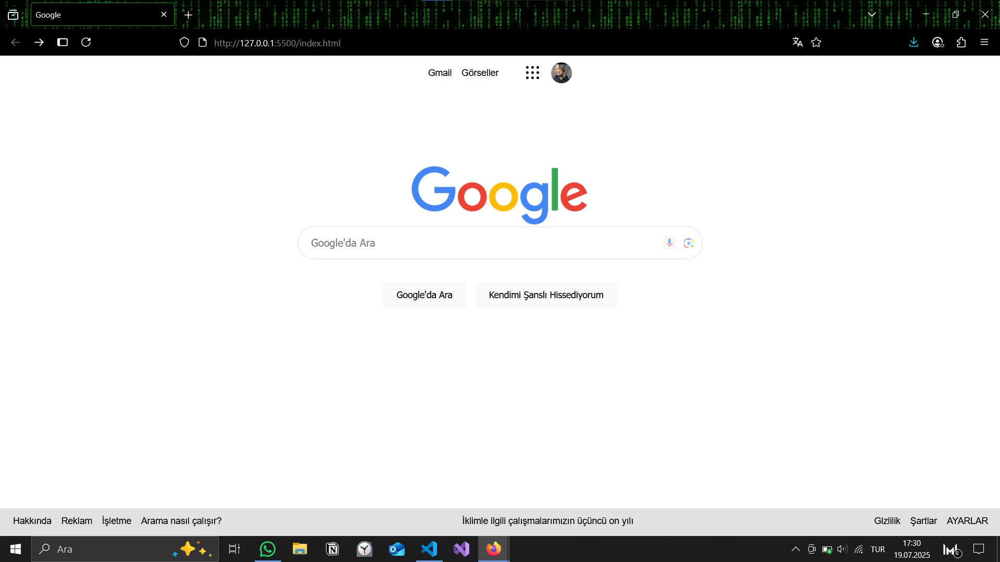

<<<<<<< HEAD
# Google Current Web Page
Bu proje, Google'ın güncel ana sayfa tasarımını HTML ve CSS kullanarak yeniden oluşturuldu.

## İçerik

- HTML5
- CSS3
- Responsive değildir!!!

## Nasıl Çalıştırılır?

1. Projeyi bilgisayarınıza indirin.
2. index.html dosyasını bir tarayıcıda açın.

## Ekran Görüntüsü

## Lisans

Bu proje [MIT Lisansı](LICENSE) ile lisanslanmıştır.
=======
# Googlecurrentwebpage
>>>>>>> 8474ba85908792152654c966d68a76eae8e94be5
